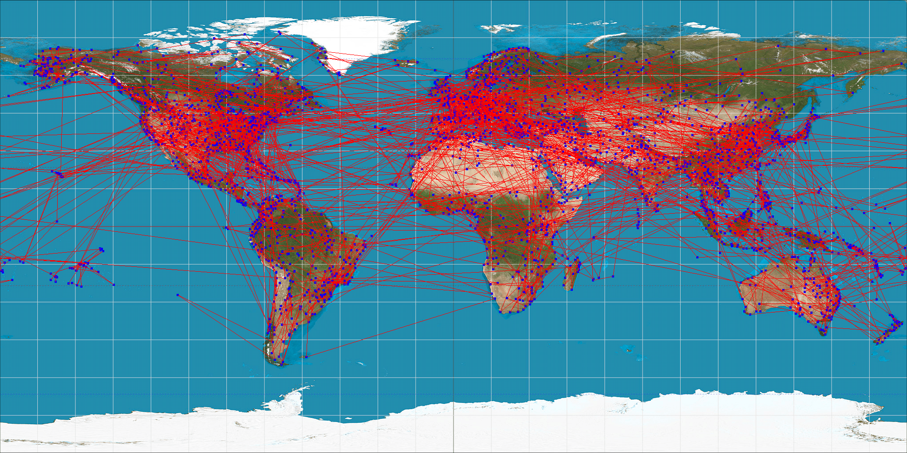

# ngao4-yiming14-zhai11-txiao5
Final Project repo for ngao4-yiming14-zhai11-txiao5

# **Final project: Graph Algorithms with Open Flights**

**Name: Gabriel Gao(ngao4), Yiming Zhao (yiming14), Tiancheng Xiao(txiao5), Haoyu Zhai(zhai11)**

## **Project presentation video**
https://youtu.be/Bsvvu_ICgtQ

## **Project functionality**

The project is able to:
- Construct a weighted and directed graph consisting of airports (vertices) and routes (edges) automatically using string data from .dat files
- Achieve graph traversal through all airports (vertices) and routes (edges) in Open Flights using Breadth-First Traversal (BFS)
- Find the path that has the shortest distance between two airports using Dijkstra's Algorithm
- Display the airports and the path on a PNG image using Bresenham’s Line Drawing Algorithm

## **Data**

All databases used in this project are provided by Open Flights. Specifically, airports.dat and routes.dat are the full-scale databases to construct the vertices (airports) and edges (routes) of the graph. All databases are stored in the “/data” folder of the project directory.

Users can also create their own preferred .dat databases for other transportation applications using the following format:

Vertices (airports or other stations)

    vertex_id,"Name","City","Country","Code_type_1","Code_type_2",latitude,longitude,altitude,timezone,"DST","Tz database time zone","Type","Source (where data is from)"

Edges (routes between two airports or two stations)

    Airline,Airline ID,Source airport,Source airport ID,Destination airport,Destination airport ID,Codeshare,number of stops,Equipment

## **Major code** (Detailed description of each function and the instructions for use are in the .h files) 

Major code files are in the project directory. They are:
- read.h and read.cpp

  Read class includes functions that read, process, and import string data from .dat into more efficient C++ data structures for other classes to access. The class contains three public functions that can be called in other classes: readRoute, readAirportPosition, and AirportIdDictionary.

- graph.h and graph.cpp

  Graph class includes constructors and default graph functions (addVertex, addEdge, …) required to build a weighted graph containing an adjacency list. The class also includes two nested structs: Vertex and Edge. Different from the default vertex and edge, the nested Vertex includes the latitude and longitude of the airport, and the nested Edge contains a weight (distance) between two vertices.

- functions.h and functions.cpp

  Functions class contains two functions: BFS and Dijkstra. BFS is developed to perform graph traversal, and Dijkstra algorithm is developed to find the shortest path between two vertices. Both functions are public and can be called by other classes.

- draw.h and draw.cpp

  Draw class contains functions that draw points on a PNG using vertices given, draw lines on a PNG according to edges, draw the shortest path (with points and lines) between two airports on a world map, and write the PNG to a file.

## **Main.cpp and using different input data**

Main.cpp is divided into 4 sections and each section has a comment above describing its functionality. Combined together, 4 sections can perform the functionalities: constructing the graph, BFS traversal, draw the traversal to an image map, find the shortest path between two airports, and draw the path on a map.

Users can also focus on a specific functionality by commenting other sections out. However, it is recommended to keep the graph constructed for all usages.

Additionally, users can modify the airports and routes databases, if they have customized databases, by changing the values of airportsDir and routesDir at line 15 and 16 to:

	string airportsDir = “airport database file directory”;
	string routesDir = “route database file directory”;

Users can change different airport ID to start the BFS traversal by changing bfsStartId at line 20:

  string bfsStartId = "starting airport’s id";

Users can also input different airport IDs to find the shortest path between them. To achieve this, users can modify the values of startId and endId at line 54 and 56:

	string startId = “starting airport’s id”;
	string endId = “destination airport’s id”;

## **Compiling and running the code**

The Makefile for this project will produce an main executable (all lower case main). The following command will make main:

    make

Then run then program:

    ./main

## **Results**

Main class will output the first airport visited and the last airport visited in the BFS traversal and the size of the connected graph in the terminal. Then the class will store a map image consisting of all routes and airports to "all_airlines.png" in the project directory. Also, the class will output all airports contained in the shortest path between two airports and store the path as an image named as "output_map.png" in the shortest directory.

Result in the terminal:

BFS Traversal on the map "all_airlines.png"

Shortest path on the map "output_map.png"

## **Test cases**

The project also has auto test code that is located in the “/tests” folder. Additional databases that are used in the test suite is located in the project directory: “Airport_testcase_1.dat”, “Airport_testcase_2.dat”, “route_testcase_1.dat”, and “route_testcase_2.dat”. 

Airports in databases are arbitrarily selected from the full-scale databases, and corresponding routes are added to the route test case database. We used smaller-scaled databases because the expected results in test cases are manually calculated by hand to maintain the accuracy and purpose of the autotest. However, the code works perfectly with full-scale databases in main.cpp.

There are 4 types of test cases:
- Reading file correctly
- Construct Graph successfully
- BFS traversal
- Shortest Path

## **Testing**

The Makefile will also produce a test executable. The following command will make test and run the test program:

    make test
    ./test

To run a specific test case:

    ./test "Reading file correctly" #Reading file correctly
    ./test "Construct Graph successfully" #Construct Graph successfully
    ./test "BFS traversal 1" #BFS traversal
    ./test "Shortest Path_1""NGO--CTU" #Shortest Path between NGO to CTU

