# **CS 225 Data Structures**

# **Results**

**Name: Gabriel Gao(ngao4), Yiming Zhao (yiming14), Tiancheng Xiao(txiao5), Haoyu Zhai(zhai11)**

## **Read Data:**

To test the functions of the read class, we use the member variables that belong to the graph class. We test the size of the member variables. Also, we compare the expected values which are inside the member variables with the actual values to see whether they match with each other. We use  “Airport_testcase_1.dat” and “route_testcase_1.dat” to test whether the read functions work. The format given by the dataset is like the screenshots shown below.

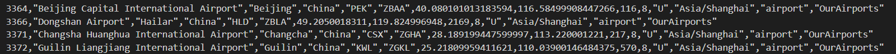

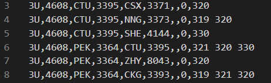

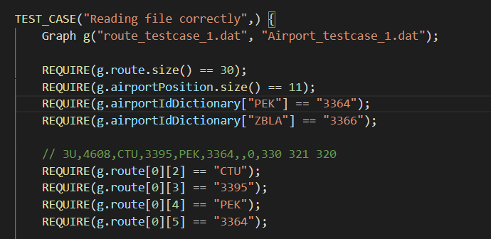

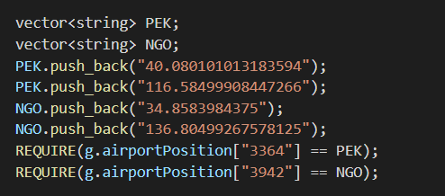

## **Graph and Graph constructor:**
### **Discoveries:**

We implemented an adjacency list to minimize the runtime of most operations in this project. Moreover, because we have too many vertices in this project, and vertices are incomparable with each other (using a vector is unnecessary and slow), we decided to implement the adjacency list using map data structure to reduce the searching time.

Graph has two maps: map<string, Vertex> vertices and map<string, list<Edge>> adjacencyList. We use two maps instead of  map<Vertex, list<Edge>> to simplify searching (we can use a string for the key instead of constructing a vertex).

map vertices:

| vertex_id | Vertex(vertex_id, latitude, longitude) |
| :-------: | :----------------------------: |
| 507 | 507, 51.4706, -0.461941 |
| 3830 | 3830, 41.9786, -87.9048|
...

map adjacencyList:

| vertex_id | Edge(source_id_1, destination_id_1, distance_1)  ->  Edge(source_id_2, destination_id_2, distance_2)  ->  Edge(source_id_3, destination_id_3, distance_3) -> ... |
| :-------: | :-------------------------------------------------------------------------: |
| 507 | (507, 344, distance_1) -> (507, 342, distance_2) -> (507, 350, distance_3) -> ... |
| 3830 | (3830, 4019, distance_1) -> (3830, 5718, distance_2) -> ... |
...

To test the graph's functionality, we can focus on two criteria: getVertex() and getEdge().

We can construct a new vertex object (with correct latitude and longitude) and get the vertex with the identical id from the graph to see if they are equal.

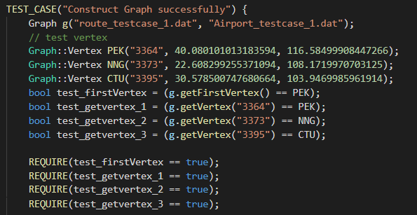

We can also test the edges using a similar method.

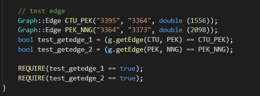

Since this both read and graph are fundamental functionalities of the project, it is repeatedly used in more sophisticated algorithms, which are “tests.”

## **BFS:**

To test the functionality of the BFS algorithm, we decided to test using two criteria: the order of visited vertices and the size of vertices traversed. In this example, we use “Airport_testcase_2.dat” and “route_testcase_2.dat” for vertices and edges.

This is a list of all vertices with their adjacent vertices (the order will be fixed every time since the data is read in the same order).

    178: 3877, 3830, 193
    193: 3364, 3830, 178
    1555: 3364, 3484, 3830
    3364: 3830, 193, 1555, 3484
    3484: 3364, 1555, 3830, 3877
    3830: 3364, 3484, 3877, 1555, 178, 193
    3877: 3484, 3830, 178

Starting from 1555, the order of visited vertices will be: 1555, 3364, 3484, 3830, 193, 3877, 178

BFS output:

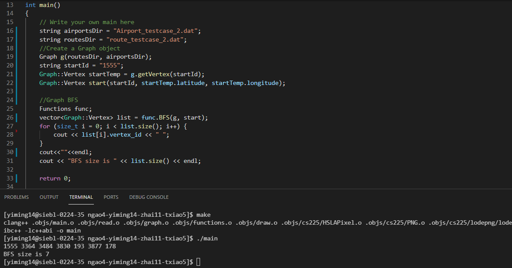

Similarly, the BFS can be used for full-scaled databases and output the following results (we only print the first visited and the last visited because the size of visited vertices is too large):

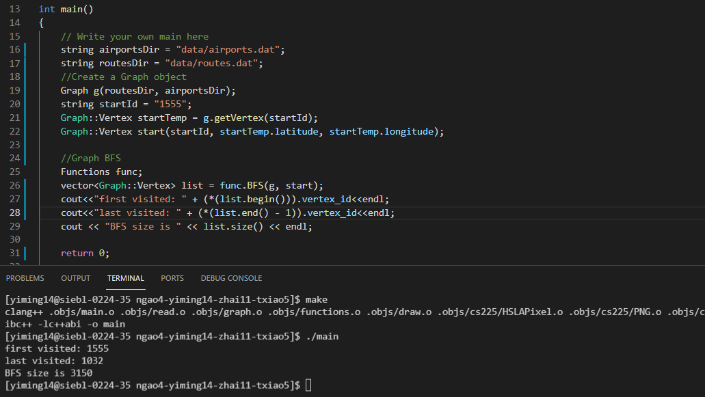

## **Dijkstra’s Algorithm:**

To test the functionality of Dijkstra’s Algorithm, we decided to test whether the code base result is really the shortest route by comparing the distance of all possible paths by hand. We use the data sets “Airport_testcase_1.dat” and “route_testcase_1.dat” as vertices and edges.

Here is the manual calculation of different test cases:

test case 1: use CTU as start, NGO as destination

 	path 1: CTU-1556-PEK-1871-NGO = 3427
  	path 2: CTU-2134-SHE-1383-NGO = 3517
  	path 3: CTU-980-NNG-3090-NGO = 4070
  	path 4: CTU-844-KWL-2779-NGO = 3623

Thus path 1: CTU-PEK-NGO is the shortest path, matches the code base result

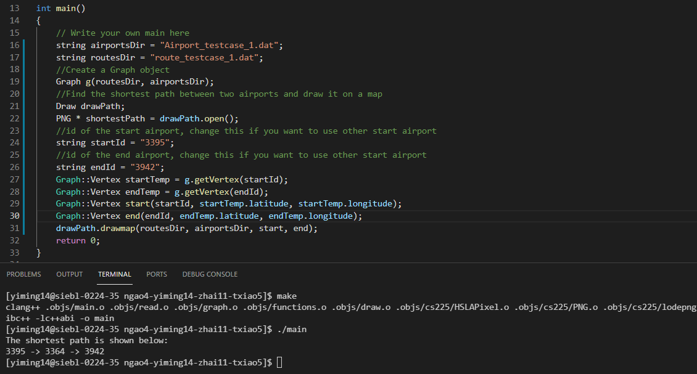

test case 2: use NGO as start, KWL as destination

	path 1: NGO-1871-PEK-1761-KWL = 3632
    path 2: NGO-2841-ZHY-1449-KWL = 4290
    path 3: NGO-3127-XNN-1479-KWL = 4606
    path 4: NGO-2114-HLD-2012-KWL = 4126

Thus path 1: NGO-PEK-KWL is the shortest path, matches the code base result

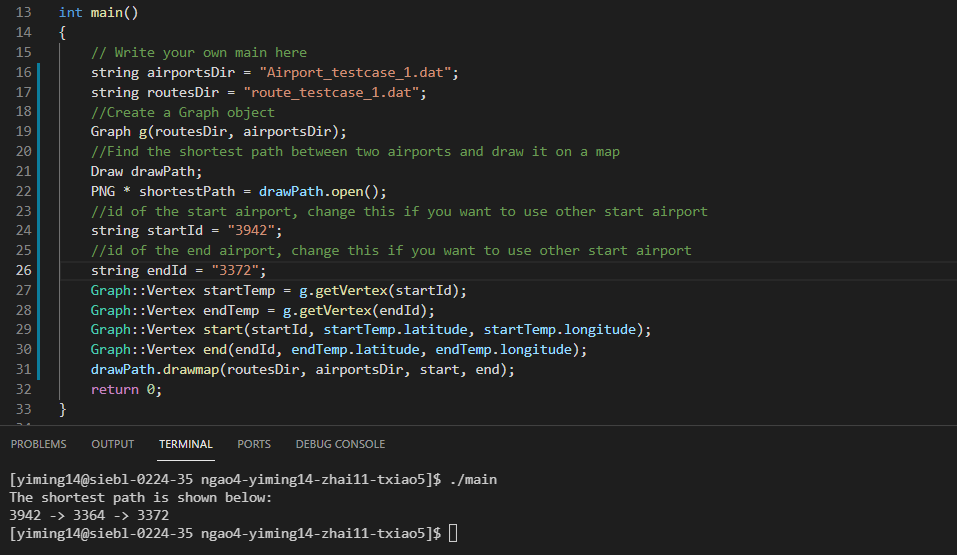

The algorithm also works for full-scale databases. For instance, the shortest distance between Dubai International Airport to Chicago O'Hare International Airport is:

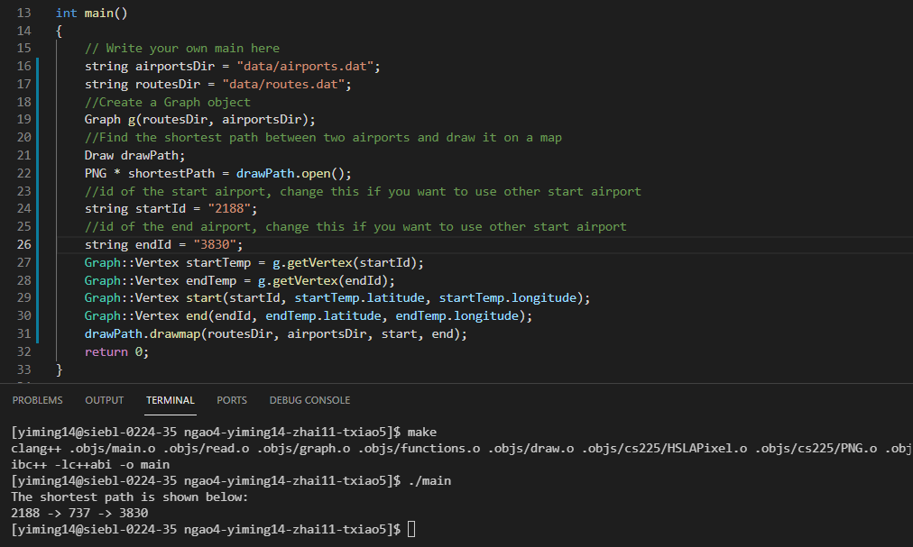

## **Draw:**

To test the functionality of Draw functions, we decided to call drawmap functions between different airports to see if the output image is reasonable. We also tried to draw all airlines in our graph using the output of the BFS algorithm.

Case 1: base case, from YYC(Calgary, Canada) to FCO(Roma, Italy)

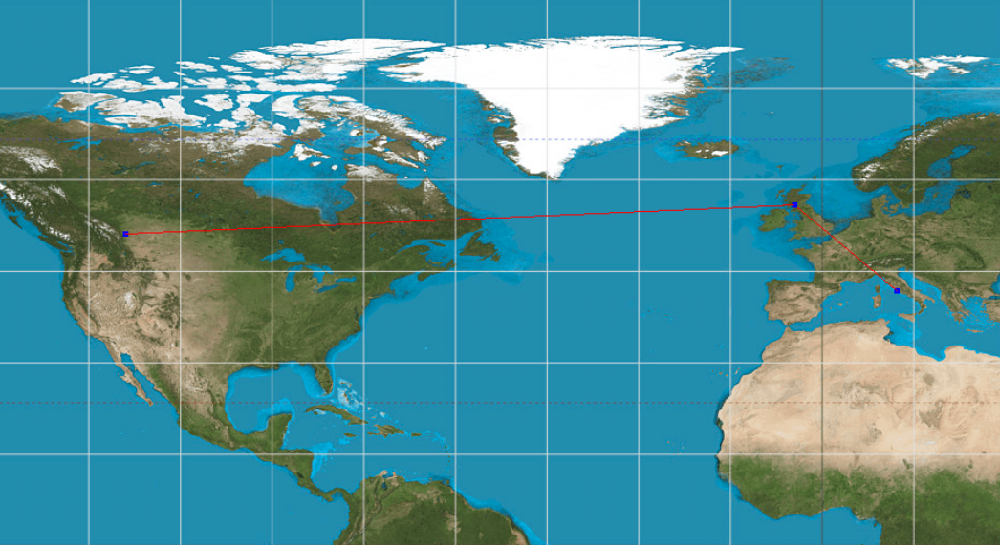

From the graph above, there is no obvious gap or disconnection between the airlines. All airports and airlines are successfully drawn.

Case 2: special case, from YYC(Calgary, Canada) to CGO(Zhengzhou, China)

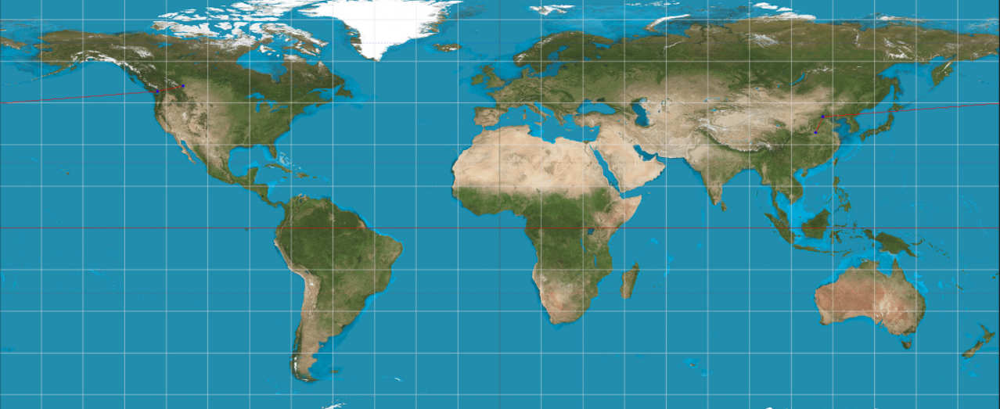

From the graph above, there is no obvious gap or disconnection between the airlines. And in this case, the line is divided into two parts at the left and right ends of the map, which is consistent with the actual situation.

### **Discoveries:**

When implementing drawline functions, we met lots of difficulties. Firstly, we used the ratio (delta_y / delta_x) to draw the line. However, because pixels are integers, we must round the ratio, which causes a significant amount of error when two airports are too far apart. Then we tried the linear model y=mx + b. But it also failed with significant rounding errors. 

After that, we tried Bresenham’s Line Drawing Algorithm. In Bresenham’s algorithm, there’s a variable error in addition to the variable ratio. Every time the x coordinate is increased by 1, the error will increase by the amount of ratio. When the error is larger than 0.5, we increase the y coordinate by 1 to fit the line and then minus error by 1. We considered all different situations like whether delta_y is greater than delta_x, including the special case as shown above. As proved above, this algorithm can be run successfully. 

